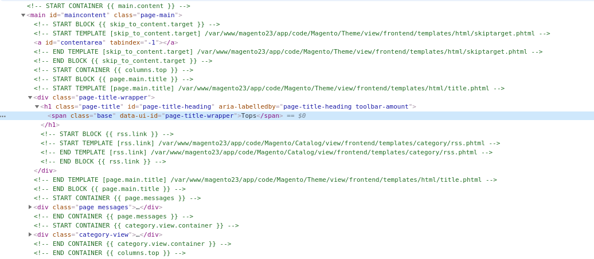
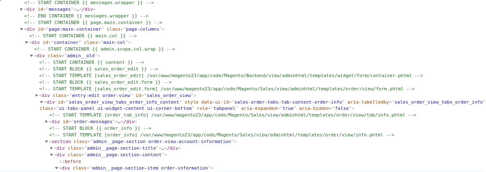

# SourceHints for Magento 2
Hints for templates/blocks/containers when inspecting code

Example from homepage:


Example from admin order page:


## Requirements

* Magento 2.2 or newer
* PHP 7.0 or newer

## Installation

Run following commands:
```
composer require --dev papec/source-hints
./bin/magento module:enable Papec_SourceHints
./bin/magento setup:upgrade
```
